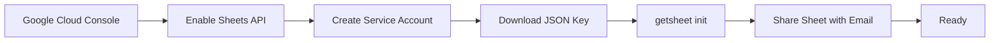
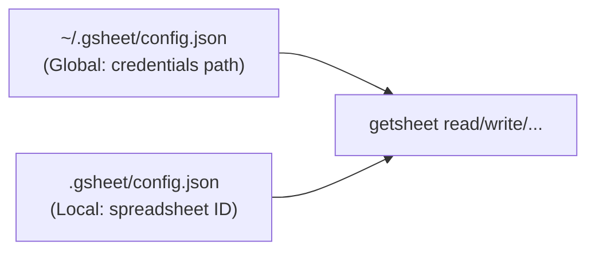

```
   ______     __  _____ __              __
  / ____/__  / /_/ ___// /_  ___  ___  / /_
 / / __/ _ \/ __/\__ \/ __ \/ _ \/ _ \/ __/
/ /_/ /  __/ /_ ___/ / / / /  __/  __/ /_
\____/\___/\__//____/_/ /_/\___/\___/\__/
```

GetSheet is a Node.js CLI tool for reading, writing and managing Google Sheets from the terminal. It acts as a shared sketchpad between you and your AI agent — push tables, pull data, create charts.

## Quickstart

```bash
git clone https://github.com/a6b8/get-sheet.git
cd get-sheet
npm install
npm link

getsheet init --credentials ~/keys/service-account.json --spreadsheet <SPREADSHEET_ID>
getsheet info
getsheet tabs
```

## Features

- **Read & write** - Push and pull data as 2D arrays
- **Append rows** - Add data without overwriting existing content
- **Tab management** - List tabs, create new tabs
- **Charts** - Create BAR, LINE, PIE, COLUMN, AREA, SCATTER charts
- **Two-tier config** - Global credentials in `~/.gsheet/`, per-project spreadsheet in `.gsheet/`
- **Service account auth** - Uses Google service account JSON key

## Table of Contents

- [Quickstart](#quickstart)
- [Features](#features)
- [Setup](#setup)
- [CLI Usage](#cli-usage)
- [Commands](#commands)
- [Configuration](#configuration)
- [License](#license)

## Setup



1. Create a Google Cloud project and enable the **Google Sheets API**
2. Create a **service account** and download the JSON key
3. Run `getsheet init --credentials <path-to-json> --spreadsheet <id>`
4. Run `getsheet info` to see the service account email
5. Share your Google Sheet with that email (Editor role)

The Spreadsheet ID is in the URL:

```
https://docs.google.com/spreadsheets/d/<SPREADSHEET_ID>/edit
```

## CLI Usage

GetSheet provides nine commands: `init`, `read`, `write`, `append`, `clear`, `tabs`, `addtab`, `chart`, and `info`.

```bash
getsheet <command> [options]
```

### Commands Overview

| Command | Description |
|---------|-------------|
| `init` | Initialize credentials and link a spreadsheet |
| `read` | Read data from a tab |
| `write` | Write data to a tab |
| `append` | Append rows to a tab |
| `clear` | Clear a range |
| `tabs` | List all tabs |
| `addtab` | Create a new tab |
| `chart` | Create a chart from a data range |
| `info` | Show service account email and setup info |

## Commands

### `init`

First-time setup with credentials, or link a new spreadsheet to the current directory.

**Usage**

```bash
# First time (sets up credentials + spreadsheet)
getsheet init --credentials <path> --spreadsheet <id>

# Additional directories (credentials already configured)
getsheet init --spreadsheet <id>
```

| Flag | Type | Description | Required |
|------|------|-------------|----------|
| `--credentials` | string | Path to Google service account JSON | First time only |
| `--spreadsheet` | string | Google Spreadsheet ID | Yes |

**Returns**

```json
{
    "status": true,
    "message": "Initialized. Share your spreadsheet with: agent@project.iam.gserviceaccount.com",
    "clientEmail": "agent@project.iam.gserviceaccount.com",
    "spreadsheet": "1dXXCi8Dc5ZiMh8IvwUlN08jBz-yCFczF_qpQ3wU3Kdw"
}
```

### `read`

Read data from a spreadsheet tab.

**Usage**

```bash
getsheet read [--tab <name>] [--range <range>]
```

| Flag | Type | Description | Required |
|------|------|-------------|----------|
| `--tab` | string | Tab name (default: Sheet1) | No |
| `--range` | string | Cell range, e.g. `A1:D10` (default: all) | No |

**Examples**

```bash
getsheet read --tab Sheet1
getsheet read --tab Sheet1 --range A1:C10
```

**Returns**

```json
{
    "status": true,
    "range": "Sheet1!A1:C4",
    "rows": 4,
    "data": [
        ["Name", "Score", "Status"],
        ["Alice", "95", "passed"],
        ["Bob", "87", "passed"],
        ["Charlie", "72", "pending"]
    ]
}
```

### `write`

Write data to a spreadsheet tab. Overwrites existing content in the target range.

**Usage**

```bash
getsheet write --tab <name> [--range <range>] --data '<json>'
```

| Flag | Type | Description | Required |
|------|------|-------------|----------|
| `--tab` | string | Tab name | Yes |
| `--range` | string | Start range, e.g. `A1` | No |
| `--data` | string | 2D array as JSON string | Yes |

**Examples**

```bash
# Write with headers
getsheet write --tab Sheet1 --data '[["Name","Score"],["Alice",95],["Bob",87]]'

# Write to specific range
getsheet write --tab Sheet1 --range A1 --data '[["Name","Score"]]'
```

**Returns**

```json
{
    "status": true,
    "updatedRange": "Sheet1!A1:B3",
    "updatedRows": 3,
    "updatedColumns": 2,
    "updatedCells": 6
}
```

### `append`

Append rows to the end of existing data in a tab.

**Usage**

```bash
getsheet append --tab <name> --data '<json>'
```

| Flag | Type | Description | Required |
|------|------|-------------|----------|
| `--tab` | string | Tab name | Yes |
| `--data` | string | 2D array as JSON string | Yes |

**Example**

```bash
getsheet append --tab Sheet1 --data '[["Charlie",92]]'
```

**Returns**

```json
{
    "status": true,
    "updatedRange": "Sheet1!A5:B5",
    "updatedRows": 1,
    "updatedColumns": 2,
    "updatedCells": 2
}
```

### `clear`

Clear a range of cells in a tab.

**Usage**

```bash
getsheet clear [--tab <name>] [--range <range>]
```

| Flag | Type | Description | Required |
|------|------|-------------|----------|
| `--tab` | string | Tab name (default: Sheet1) | No |
| `--range` | string | Cell range to clear (default: all) | No |

**Example**

```bash
getsheet clear --tab Sheet1 --range B2:B10
```

**Returns**

```json
{
    "status": true,
    "clearedRange": "Sheet1!B2:B10"
}
```

### `tabs`

List all tabs in the spreadsheet.

**Usage**

```bash
getsheet tabs
```

**Returns**

```json
{
    "status": true,
    "total": 2,
    "tabs": [
        {
            "title": "Sheet1",
            "index": 0,
            "sheetId": 0,
            "rowCount": 1000,
            "columnCount": 26
        },
        {
            "title": "Benchmarks",
            "index": 1,
            "sheetId": 123456789,
            "rowCount": 1000,
            "columnCount": 26
        }
    ]
}
```

### `addtab`

Create a new tab in the spreadsheet.

**Usage**

```bash
getsheet addtab --name <name>
```

| Flag | Type | Description | Required |
|------|------|-------------|----------|
| `--name` | string | Name for the new tab | Yes |

**Example**

```bash
getsheet addtab --name Benchmarks
```

**Returns**

```json
{
    "status": true,
    "message": "Tab \"Benchmarks\" created",
    "name": "Benchmarks"
}
```

### `chart`

Create a chart embedded in the spreadsheet from a data range.

**Usage**

```bash
getsheet chart --tab <name> --range <range> [--type <type>] [--title <title>]
```

| Flag | Type | Description | Required |
|------|------|-------------|----------|
| `--tab` | string | Tab containing the data | Yes |
| `--range` | string | Data range, e.g. `A1:B5` | Yes |
| `--type` | string | Chart type (default: COLUMN) | No |
| `--title` | string | Chart title | No |

**Chart Types**

| Type | Description |
|------|-------------|
| `BAR` | Horizontal bar chart |
| `LINE` | Line chart |
| `PIE` | Pie chart |
| `COLUMN` | Vertical column chart (default) |
| `AREA` | Area chart |
| `SCATTER` | Scatter plot |

**Example**

```bash
getsheet chart --tab Sheet1 --range A1:B4 --type BAR --title "Scores"
```

**Returns**

```json
{
    "status": true,
    "message": "BAR chart created from Sheet1!A1:B4",
    "chartType": "BAR",
    "dataRange": "Sheet1!A1:B4",
    "title": "Scores"
}
```

### `info`

Show the service account email address and current configuration. Use this to find the email you need to share your spreadsheet with.

**Usage**

```bash
getsheet info
```

**Returns**

```json
{
    "status": true,
    "clientEmail": "getsheet-agent@project.iam.gserviceaccount.com",
    "projectId": "my-project-123",
    "spreadsheet": "1dXXCi8Dc5ZiMh8IvwUlN08jBz-yCFczF_qpQ3wU3Kdw",
    "shareInstructions": "Share your Google Sheet with: getsheet-agent@project.iam.gserviceaccount.com (Editor role)"
}
```

## Configuration

GetSheet uses a two-tier configuration:



### Global Config

Stored at `~/.gsheet/config.json`. Created on first `init`.

```json
{
    "credentials": "/path/to/service-account.json"
}
```

### Local Config

Stored at `.gsheet/config.json` in your working directory. Created per project via `init --spreadsheet`.

```json
{
    "root": "~/.gsheet",
    "spreadsheet": "1dXXCi8Dc5ZiMh8IvwUlN08jBz-yCFczF_qpQ3wU3Kdw"
}
```

### Adding `.gsheet/` to `.gitignore`

The local config contains only the spreadsheet ID (no secrets), but you may want to add it to `.gitignore`:

```
.gsheet/
```

## License

This project is licensed under the MIT License - see the [LICENSE](LICENSE) file for details.
